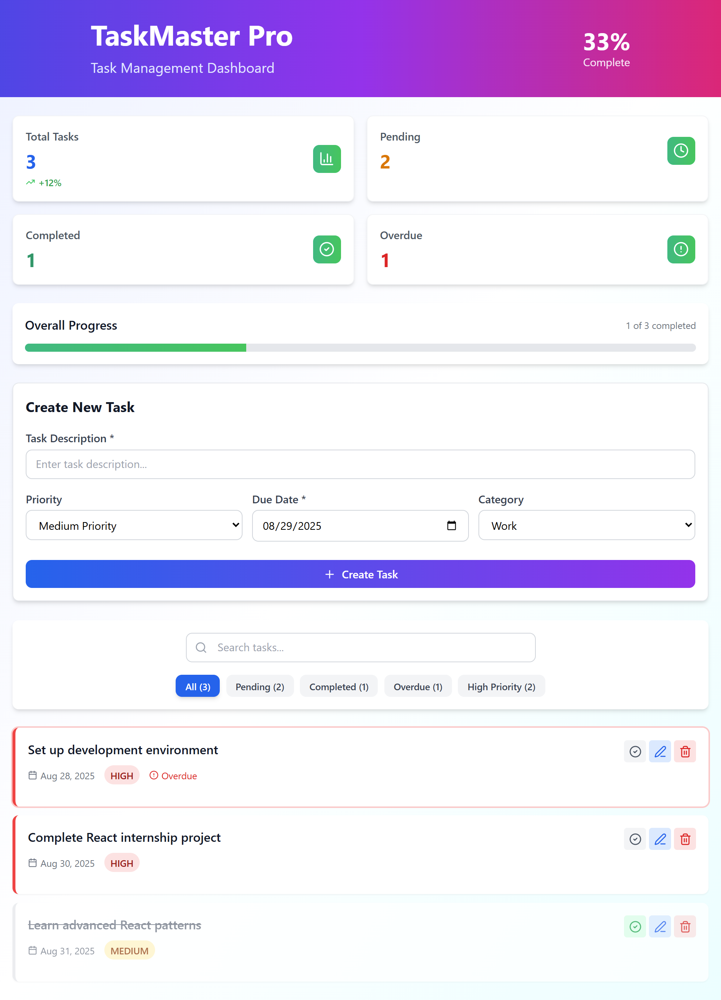

# TaskMaster Pro - React Task Management Dashboard

A modern, responsive task management application built with React, Vite, and Tailwind CSS. This project demonstrates advanced React concepts including hooks, context, state management, and responsive design.



## 🚀 Features

- ✅ **Create, Edit, Delete Tasks** - Full CRUD functionality
- ✅ **Priority Levels** - High, Medium, Low priority tasks
- ✅ **Due Date Tracking** - Never miss a deadline
- ✅ **Task Categories** - Organize by Work, Personal, Health, Education
- ✅ **Search & Filter** - Find tasks quickly
- ✅ **Progress Tracking** - Visual progress indicators
- ✅ **Responsive Design** - Works on all devices
- ✅ **Modern UI** - Clean and intuitive interface
- ✅ **Performance Optimized** - Smooth experience on low-end devices

## 🛠️ Technologies Used

- **React 18** - Frontend framework
- **Vite** - Build tool and development server
- **Tailwind CSS** - Utility-first CSS framework
- **Lucide React** - Modern icon library
- **JavaScript ES6+** - Modern JavaScript features

## 📋 Prerequisites

Before running this project, make sure you have:

- **Node.js** (version 16.0 or higher)
- **npm** (comes with Node.js)
- **Git** (for version control)

## 🚀 Installation & Setup

1. **Clone the repository**
   ```bash
   git clone https://github.com/YOUR_USERNAME/task-manager-pro.git
   cd task-manager-pro
   ```

2. **Install dependencies**
   ```bash
   npm install
   ```

3. **Start the development server**
   ```bash
   npm run dev
   ```

4. **Open your browser**
   - Go to `http://localhost:5173/`
   - The application will automatically reload when you make changes

## 🏗️ Build for Production

```bash
# Build the project
npm run build

# Preview the production build
npm run preview
```

## 📱 Responsive Design

The application is fully responsive and works seamlessly on:
- 📱 Mobile devices (320px and up)
- 📱 Tablets (768px and up)
- 💻 Desktop computers (1024px and up)
- 🖥️ Large screens (1440px and up)

## 🎯 Key React Concepts Demonstrated

- **Functional Components** - Modern React component structure
- **React Hooks** - useState, useEffect, useReducer, useMemo, useCallback
- **Custom Hooks** - useDebounce for search optimization
- **State Management** - useReducer for complex state logic
- **Performance Optimization** - Memoization and callback optimization
- **Event Handling** - Form submissions, user interactions
- **Conditional Rendering** - Dynamic UI based on state
- **Component Composition** - Reusable component architecture

## 📊 Project Structure

```
task-manager-pro/
├── public/
│   └── index.html
├── src/
│   ├── App.jsx          # Main application component
│   ├── main.jsx         # Application entry point
│   └── index.css        # Tailwind CSS imports and custom styles
├── package.json         # Project dependencies and scripts
├── tailwind.config.js   # Tailwind CSS configuration
├── vite.config.js       # Vite build configuration
└── README.md           # Project documentation
```

## 🔧 Configuration Files

- **tailwind.config.js** - Tailwind CSS customization
- **vite.config.js** - Vite build tool settings
- **package.json** - Dependencies and npm scripts

## 📈 Performance Features

- **Debounced Search** - Optimized search with 300ms delay
- **Memoized Calculations** - Cached statistics and filtered data
- **Efficient Re-renders** - useCallback for stable function references
- **Lightweight Components** - Minimal DOM manipulation
- **CSS Optimizations** - Tailwind's purged CSS for smaller bundle

## 🎨 Design Features

- **Modern Gradient Backgrounds** - Eye-catching visual design
- **Smooth Animations** - Subtle transitions and hover effects
- **Intuitive Icons** - Clear visual indicators using Lucide React
- **Color-Coded Priority** - Visual priority system
- **Progress Visualization** - Animated progress bars

## 📝 Future Enhancements

- [ ] Add drag-and-drop functionality
- [ ] Implement task due date notifications
- [ ] Add dark mode support
- [ ] Include task sharing capabilities
- [ ] Add data persistence with backend integration
- [ ] Implement user authentication
- [ ] Add task templates
- [ ] Include time tracking features

## 🤝 Contributing

This project was created as part of an internship program. If you'd like to suggest improvements:

1. Fork the repository
2. Create a feature branch (`git checkout -b feature/improvement`)
3. Commit your changes (`git commit -am 'Add some improvement'`)
4. Push to the branch (`git push origin feature/improvement`)
5. Create a Pull Request

## 📄 License

This project is open source and available under the [MIT License](LICENSE).

## 👨‍💻 Author

**Your Name**
- GitHub: [@your-username](https://github.com/your-username)
- LinkedIn: [Your LinkedIn Profile](https://linkedin.com/in/your-profile)
- Email: your.email@example.com

## 🙏 Acknowledgments

- Thanks to the internship program for the learning opportunity
- React team for the amazing framework
- Tailwind CSS team for the utility-first approach
- Lucide team for the beautiful icons

---

⭐ **If you found this project helpful, please give it a star!** ⭐